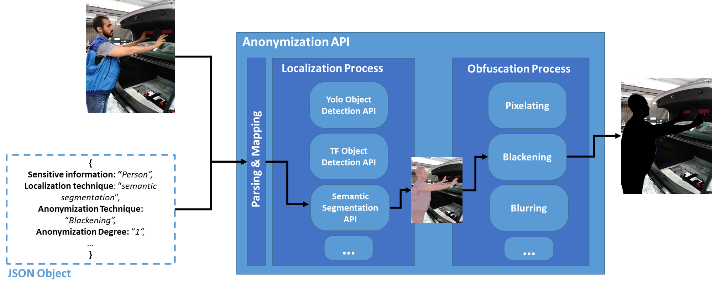

# BMW-Anonymization-Api

Data privacy and individuals’ anonymity are and always have been a major concern for data-driven companies. 

Therefore, we designed and implemented an anonymization API that localizes and obfuscates (i.e. hides) sensitive information in images/videos in order to preserve the individuals' anonymity. The main features of our anonymization tool are the following:
* **Agnostic in terms of localization techniques**: our API currently supports [Semantic segmentation](https://github.com/BMW-InnovationLab/BMW-Semantic-Segmentation-Inference-API-GPU-CPU) or [Object Detection](https://github.com/BMW-InnovationLab/BMW-TensorFlow-Inference-API-GPU).
* **Modular in terms of sensitive information**: the user can train a Deep Learning (DL) model for [object detection](https://github.com/BMW-InnovationLab/BMW-TensorFlow-Training-GUI) and semantic segmentation (the training gui will be published soon) to localize the sensitive information she/he wishes to protect, e.g., individual's face or body, personal belongings, vehicles...
* **Scalable in terms of anonymization techniques**: our API currently supports pixelating, blurring, blackening (masking). Also, additinal anonymization techniques can be configured as stated below. For the highest level of privacy, we recommend using the blackening technique with degree 1.
* **Supports DL-based models optimized via the [Intel® OpenVINO™ toolkit v2021.1](https://docs.openvinotoolkit.org/latest/index.html) for CPU usage**: DL-based models optimized and deployed via the [Openvino Segmentation Inference API](https://github.com/BMW-InnovationLab/BMW-IntelOpenVINO-Segmentation-Inference-API) and the [Openvino Detection Inference API](https://github.com/BMW-InnovationLab/BMW-IntelOpenVINO-Inference-API) can also be used.
* **Compatible with the BMW Deep Learning tools**: DL models trained via our [training](https://github.com/BMW-InnovationLab/BMW-TensorFlow-Training-GUI) and deployed via our [inference](https://github.com/BMW-InnovationLab/BMW-TensorFlow-Inference-API-GPU) APIs are compatible with this anonymization API. 

<p align="center">
  
</p>


## General Architecture & Deployment Mode:

Our anonymization API receives an image along with a JSON object through which the user specifies mainly: 
* The sensitive information she/he wishes to obfuscate.
* The anonymization technique.
* The anonymization degree.
* The localization technique. 

 

You can deploy the anonymization API either:
* As a standalone docker container which can be connected to other inference APIs ([object detection](https://github.com/BMW-InnovationLab/BMW-YOLOv4-Inference-API-CPU) or [semantic segmentation](https://github.com/BMW-InnovationLab/BMW-Semantic-Segmentation-Inference-API-GPU-CPU)) deployed within a standalone docker container as well.
* As a network of docker containers along with other inference APIs running on the same machine via docker-compose. (please check the [following link](./docker_compose_readme.md) for the docker-compose deployment).


## Prerequisites:
- docker
- docker-compose

### Check for prerequisites

#### To check if docker-ce is installed:
```sh
docker --version
```

#### To check if docker-compose is installed:
```sh
docker-compose --version
```

### Install prerequisites

#### Ubuntu

To install [Docker](https://docs.docker.com/engine/install/ubuntu/) and [Docker Compose](https://docs.docker.com/compose/install/) on Ubuntu, please follow the link.

#### Windows 10

To [install Docker on Windows](https://docs.docker.com/docker-for-windows/install/), please follow the link.

**P.S: For Windows users, open the Docker Desktop menu by clicking the Docker Icon in the Notifications area. Select Settings, and then Advanced tab to adjust the resources available to Docker Engine.**

## Build The Docker Image

As mentioned before, this container can be deployed using either **docker** or **docker-compose**.

* If you wish to deploy this API using **docker-compose**, please refer to [following link](./docker_compose_readme.md). After deploying the API with docker compose, please consider returning to this documentation for further information about the API Endpoints and use configuration file sample sections.

* If you wish to deploy this API using **docker**, please continue with the following docker build and run commands.

In order to build the project run the following command from the project's root directory:

```sh
 docker build -t anonymization_api -f docker/dockerfile .
```
#### Build behind a proxy
In order to build the image behind a proxy use the following command in the project's root directory:
```sh
docker build --build-arg http_proxy='your_proxy' --build-arg https_proxy='your_proxy' -t anonymization_api -f ./docker/dockerfile .
```
In case of build failure, the docker image python:3.6 should be updated to a newer version:
```sh
docker pull python:3.6
```

## Run the docker container

To run the API, go to the API's directory and run the following:

#### Using Linux based docker:

```sh
sudo docker run -itv $(pwd)/src/main:/main -v $(pwd)/jsonFiles:/jsonFiles -p <port_of_your_choice>:4343 anonymization_api
```
##### Behind a proxy:
```sh
sudo docker run -itv $(pwd)/src/main:/main -v $(pwd)/jsonFiles:/jsonFiles  --env HTTP_PROXY="" --env HTTPS_PROXY="" --env http_proxy="" --env https_proxy="" -p 5555:4343 anonymization_api
```

#### Using Windows based docker:

```sh
docker run -itv ${PWD}/src/main:/main -v ${PWD}/jsonFiles:/jsonFiles -p <port_of_your_choice>:4343 anonymization_api
```

The API file will be run automatically, and the service will listen to http requests on the chosen port.

## API Endpoints

To see all available endpoints, open your favorite browser and navigate to:

```
http://<machine_IP>:<docker_host_port>/docs
```

### Endpoints summary
 

#### Configuration 


##### /set_url (POST)

Set the URL of the inference API that you wish to connect to the Anonymization API. If the specified URL is unreachable due to connection problems, it will not be added to the [JSON url_configuration file](https://github.com/BMW-InnovationLab/BMW-Anonymization-API/blob/master/jsonFiles/url_configuration.json). The URL should be specified in the following format  "http://ip:port/".

##### /list_urls (GET)

Returns the URLs of the inference APIs that were already configured via the /set_url POST request.

##### /remove_url (POST)

Removes the specified URL from the [JSON url_configuration file](https://github.com/BMW-InnovationLab/BMW-Anonymization-API/blob/master/jsonFiles/url_configuration.json)

##### /remove_all_urls (POST)

Removes all available urls from the [JSON url_configuration file](https://github.com/BMW-InnovationLab/BMW-Anonymization-API/blob/master/jsonFiles/url_configuration.json)

##### /available_methods/ (GET)

After setting the inference URLs via the /set_url request, the user can view the Anonymization API's configuration by issuing the /available_methods request. Mainly the user can view (i) the supported sensitive information (label_names) , (ii) the supported localization techniques, (iii) the inference URLs and (iv) the DL model name that are configured in the deployed anonymization API as seen below.


#### Anonymization 
##### /anonymize/ (POST)

Anonymizes the input image based on the [user's JSON configuration file](https://github.com/BMW-InnovationLab/BMW-Anonymization-API/blob/master/jsonFiles/user_configuration.json)


##### /anonymize_video/ (POST)

Anonymizes a video based on the user's sensitive info and save the anonymized video in `src/main/anonymized_videos` under <original_video_name>_TIMESTAMP.mp4


#### Video Anonymization Time
The video might take a while, actually you can estimate the time that it may take by using the following formula:
**Video_Anonymization_Time = Video_Length x Number_Of_Frames_Per_Second  x Anonymization_Time_Of_Each_Frame**


## User configuration file sample

In order to anonymize an image, the user should specify the different details in the [user's JSON configuration file](https://github.com/BMW-InnovationLab/BMW-Anonymization-API/blob/master/jsonFiles/user_configuration.json)

Please check a sample in the below image:


Note that the URL field is an optional field that you can add in case you wanted to use a specific URL of a running API. You can just add the URL as an optional field in this file as shown in the first sensitive info. In case this field is not specified, the URL defined in the url_configuration.json file will be used by default if it matches all the requirements. 

## To add a new technique to the API:
Please refer to the following link [add new technique documentation](references/techniques.md) for more information on how to add a new anonymization technique to the APIs with common and custom labels.

## Benchmark

### Object Detection

<table>                                                                 
    <tr>
        <th>GPU</th>
        <th>Network</th>
        <th>Width</th>
        <th>Height</th>
        <th>Inference time</th>
        <th>Anonymization time</th>
        <th>Total</th>
    </tr>
    <tr>
        <td align = "center">Titan RTX</td>
        <td align = "center">yolov4</td>
        <td align = "center">640</td>
        <td align = "center">768</td>
        <td align = "center">0.2 s</td>
        <td align = "center">0.07 s</td>
        <td align = "center">0.27 s</td>
    </tr>
    <tr>
        <td align = "center">Titan RTX</td>
        <td align = "center">yolov4</td>
        <td align = "center">1024</td>
        <td align = "center">768</td>
        <td align = "center">0.4 s</td>
        <td align = "center">0.14 s</td>
        <td align = "center">0.54 s</td>
    </tr>
    <tr>
        <td align = "center">Titan RTX</td>
        <td align = "center">yolov4</td>
        <td align = "center">2048</td>
        <td align = "center">1024</td>
        <td align = "center">1.2 s</td>
        <td align = "center">0.6 s</td>
        <td align = "center">1.8 s</td>
    </tr>
    <tr>
        <td align = "center">Titan RTX</td>
        <td align = "center">yolov4</td>
        <td align = "center">3840</td>
        <td align = "center">2160</td>
        <td align = "center">4.8 s</td>
        <td align = "center">0.6 s</td>
        <td align = "center">5.4 s</td>
    </tr>
</table>

### Object Detection with OpenVINO model and Intel Core i7-1185G7 

The model was trained with the TensorFlow Object Detection API (TF version 1.14) and then converted to OpenVINO IR.

|**CPU**|**Network**  |**Precision** |**Width**  |**Height**  |**Inference Time (s)**  |**Anonymization Time (s)** |**Total Time (s)** <br/> for Average, Maximum, Minimum|
|:-:|:-:|:-:|:-:|:-:|:-:|:-:|:-:|
|Intel Core <br/> i7-1185G7  |  Faster R-CNN  <br/> Input Shape: [3,600,600]  |  FP32 | 1024| 768  |0.51  |0.09  |0.60, 0.67, 0.54  |
|Intel Core <br/> i7-1185G7  |  Faster R-CNN  <br/> Input Shape: [3,600,600] |  FP32  | 2048 | 1536  |0.56  |0.24  |0.80,  0.97, 0.70  |
|Intel Core <br/> i7-1185G7  |  Faster R-CNN  <br/> Input Shape: [3,600,600]  |  INT8 | 1024| 768  |0.16  |0.09  |0.25, 0.27, 0.22  |
|Intel Core <br/> i7-1185G7  |  Faster R-CNN  <br/> Input Shape: [3,600,600] |  INT8| 2048 | 1536  |0.19  |0.24  |0.43,  0.56, 0.36  |


### Semantic Segmentation
<table>                                                                 
    <tr>
        <th>GPU</th>
        <th>Network</th>
        <th>Width</th>
        <th>Height</th>
        <th>Inference time</th>
        <th>Anonymization time</th>
        <th>Total</th>
    </tr>
    <tr>
        <td align = "center">Titan RTX</td>
        <td align = "center">psp resnet 101</td>
        <td align = "center">640</td>
        <td align = "center">768</td>
        <td align = "center">0.2 s</td>
        <td align = "center">0.8 s</td>
        <td align = "center">1 s</td>
    </tr>
    <tr>
        <td align = "center">Titan RTX</td>
        <td align = "center">psp resnet 101</td>
        <td align = "center">1024</td>
        <td align = "center">768</td>
        <td align = "center">0.3 s</td>
        <td align = "center">0.8 s</td>
        <td align = "center">1.1 s</td>
    </tr>
    <tr>
        <td align = "center">Titan RTX</td>
        <td align = "center">psp resnet 101</td>
        <td align = "center">2048</td>
        <td align = "center">1024</td>
        <td align = "center">0.9 s</td>
        <td align = "center">1 s</td>
        <td align = "center">1.9 s</td>
    </tr>
    <tr>
        <td align = "center">Titan RTX</td>
        <td align = "center">psp resnet 101</td>
        <td align = "center">3840</td>
        <td align = "center">2160</td>
        <td align = "center">2 s</td>
        <td align = "center">3 s</td>
        <td align = "center">5 s</td>
    </tr>
</table>

## Possible Error

- You may encounter the below error when running the docker container at startup in standalone version or docker-compose version  
- In case you do, please make sure that the URL of the inference APIs listed in the  `jsonFiles/url_configuration.json` are still recheable. A possible solution would be to empty `jsonFiles/url_configuration.json` as seen below before starting the container:

    ```
    {
    "urls": [
    ]
    }
    ```

## Acknowledgments

Ghenwa Aoun

Antoine Charbel, [inmind.ai](https://inmind.ai/), Beirut, Lebanon

Roy Anwar

Fady Dib

Jimmy Tekli, BMW Innovation Lab, Munich, Germany
