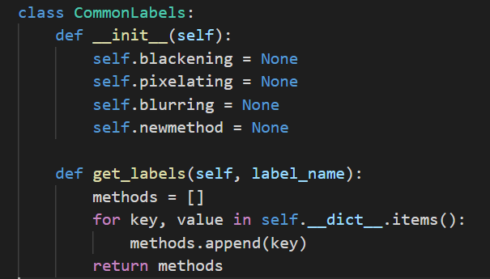
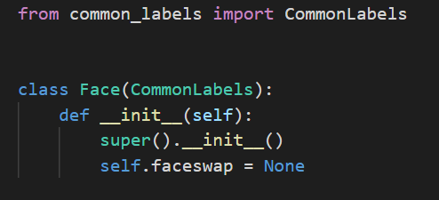

# Add a new technique to the API

It is mandatory that the techniques you are adding are actually implemented
These are the steps that should be applied so that the anonymization technique you are adding can be applicable:
- Go to "src/main/anonymization/base_anonymization.py"
- Add the signature of the method similarly to what is already implemented (name + parameters); this method will be overridden in the other files.
- Now this method should be implemented in the files that are specified in the "/src/main/anonymization" directory (except base_anonymization.py)
  These files, for example detection_anonymization.py and segmentation_anonymization.py consist of two different classes both extending the BaseAnonymization class.

## Types of labels

This API contains two types of labels: 

* Common labels
- Special labels

## Adding common labels

Common labels are the ones that support common techniques (techniques that can be applied to all labels such as blurring, pixelating and blackening in our case)
Special labels are the ones that support, in addition to the common labels techniques, a specific technique that should be specified.
Based on the above, add the following after implementing the technique:

If you want to add a common technique (for common labels; that can be applied to all labels):

Just go to "/src/main/supported_methods/common_labels.py" and add the name of the technique as an attribute to the CommonLabels class.
For example:

All the labels will automatically support the newly added technique if it is actually implemented as mentioned above.

## Adding specials labels

If you want to add a special technique (for a special label; that can be applied only to this label):
- Go to "/src/main/supported_methods"
- Create a new python file which name is the name of the special label
- This file should contain a class that represents the special label and this class will extend the CommonLabels class
- Add the special technique as an attribute
- For example if we want to add the faceswap technique that can only be applied on the face label we should create a face.py file that should look like the following:

This way, the face label will support all the common techniques in addition to the special one that will only be applied on it (faceswap) if the faceswap  technique is correctly implemented.